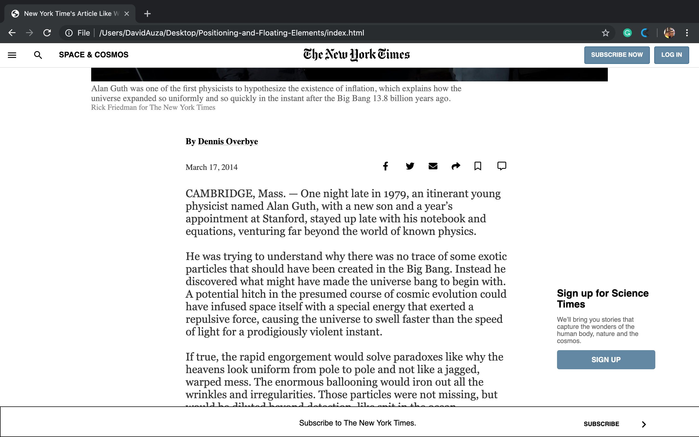
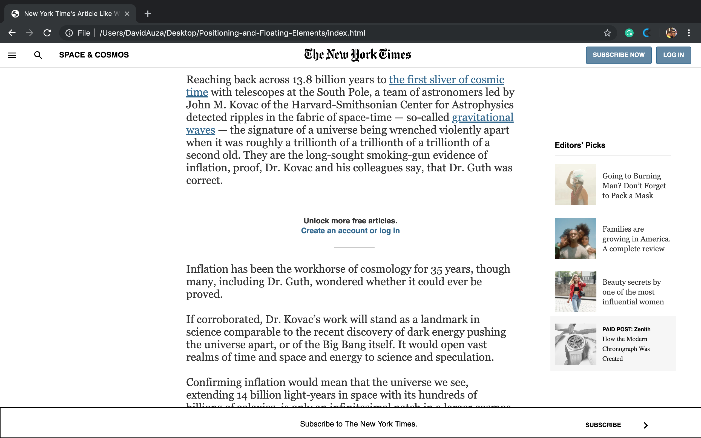
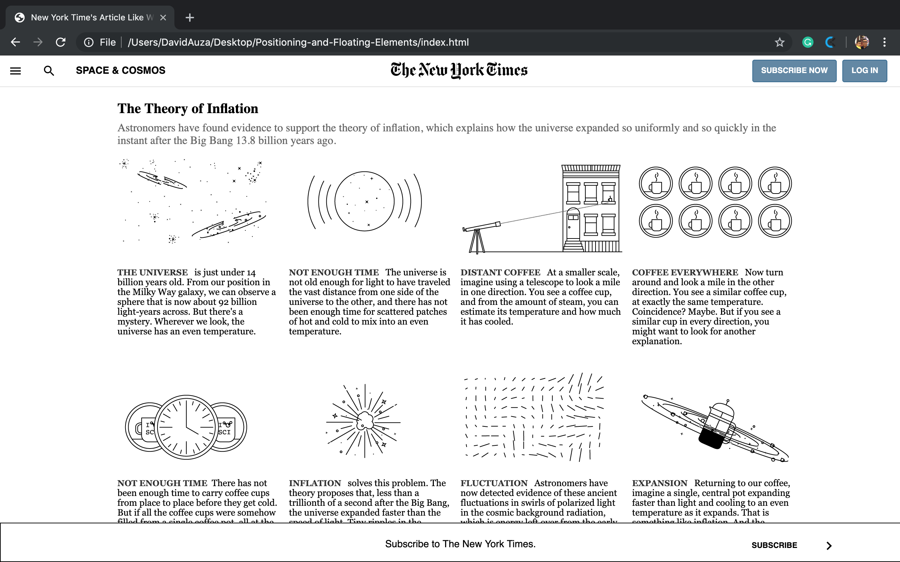
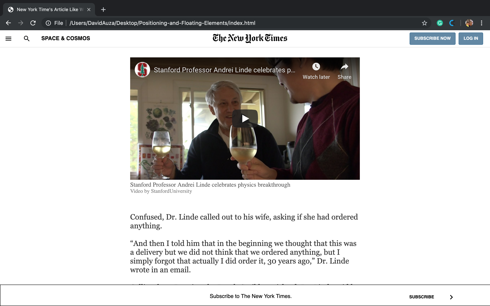
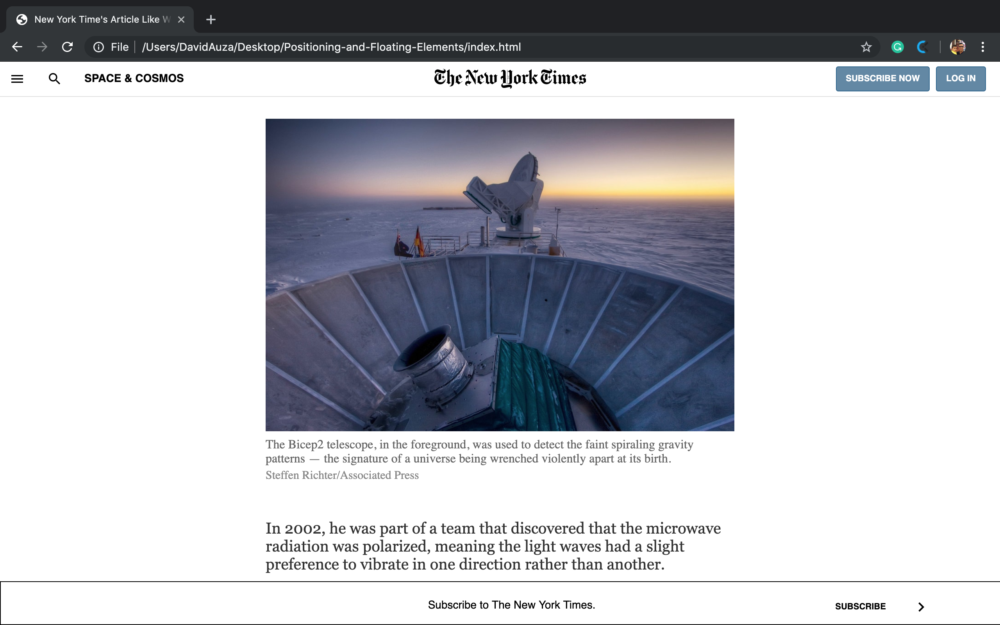

# Positioning-and-Floating-Elements 

This is our solution to Microverse's third project. It is a clone of a New York Times article. The original page is found [here](https://www.nytimes.com/2014/03/18/science/space/detection-of-waves-in-space-buttresses-landmark-theory-of-big-bang.html?_r=0). It is created using HTML5 and CSS3.

## Project contributors:

- David Auza

- Eduardo Reis

## Screenshots

### Screenshot 1

### Screenshot 2

### Screenshot 3

### Screenshot 4

### Screenshot 5

### Screenshot 6

### Screenshot 7

### Screenshot 8

### Screenshot 9

